# TREC Template Analysis Summary

**Version:** 2.0  
**Date:** November 4, 2025  
**Status:** Production Ready ✅

---

## 📋 Template Overview

### TREC REI 7-6 (8/9/21)

Official Texas Real Estate Commission Residential Inspection Report

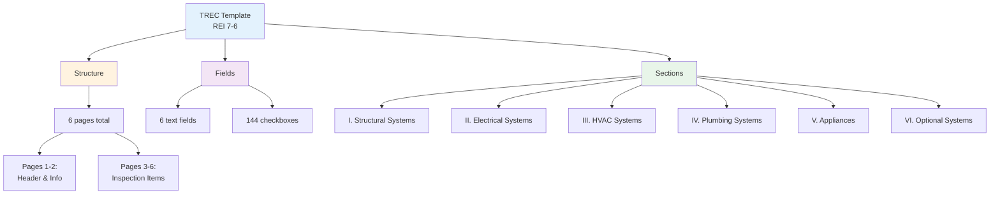

---

## 📊 Template Structure

### Page Breakdown

```mermaid
gantt
    title TREC Template Pages
    dateFormat X
    axisFormat Page %L
    
    section Header
    Page 1 Client/Inspector Info: 0, 1
    Page 2 Disclaimers/Terms: 1, 2
    
    section Inspection
    Page 3 Structural Items 1-12: 2, 3
    Page 4 Structural Items 13-24: 3, 4
    Page 5 Structural Items 25-36: 4, 5
    Page 6 Signatures/Additional: 5, 6
```

| Page | Purpose | Fields |
|------|---------|--------|
| 1 | Header information | 6 text fields |
| 2 | Disclaimers & terms | Text content |
| 3 | Inspection items 1-12 | 48 checkboxes (12×4) |
| 4 | Inspection items 13-24 | 48 checkboxes (12×4) |
| 5 | Inspection items 25-36 | 48 checkboxes (12×4) |
| 6 | Signatures & additional | Signature fields |

---

## 📝 Form Fields

### Text Fields (Page 1)

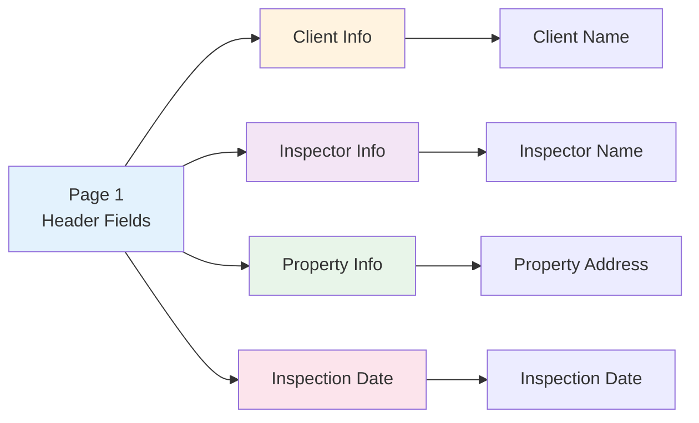

| Field Name | PDF Field Path | Type |
|------------|----------------|------|
| Client Name | `topmostSubform[0].Page1[0].ClientName[0]` | Text |
| Inspector Name | `topmostSubform[0].Page1[0].InspectorName[0]` | Text |
| Property Address | `topmostSubform[0].Page1[0].PropertyAddress[0]` | Text |
| Inspection Date | `topmostSubform[0].Page1[0].InspectionDate[0]` | Text |
| Inspector License | `topmostSubform[0].Page1[0].InspectorLicense[0]` | Text |
| Sponsor Name | `topmostSubform[0].Page1[0].SponsorName[0]` | Text |

###Checkboxes (Pages 3-5)

**Total:** 144 checkboxes (36 items × 4 statuses)

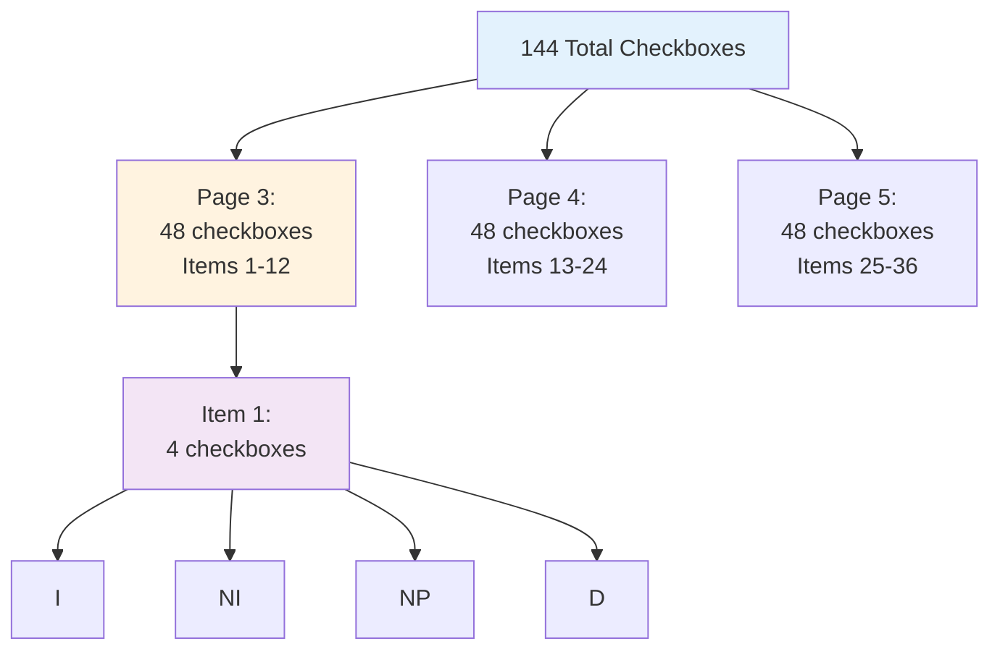

**Format:** `topmostSubform[0].Page{N}[0].CheckBox1[{index}]`

| Page | Items | Checkbox Indices |
|------|-------|------------------|
| 3 | 1-12 | 0-47 |
| 4 | 13-24 | 0-47 |
| 5 | 25-36 | 0-47 |

---

## 🏗️ TREC Sections

### Section Hierarchy

```mermaid
graph TD
    Root[TREC Inspection Report]
    
    Root --> I[I. STRUCTURAL SYSTEMS]
    Root --> II[II. ELECTRICAL SYSTEMS]
    Root --> III[III. HVAC SYSTEMS]
    Root --> IV[IV. PLUMBING SYSTEMS]
    Root --> V[V. APPLIANCES]
    Root --> VI[VI. OPTIONAL SYSTEMS]
    
    I --> IA[A. Foundations]
    I --> IB[B. Grading and Drainage]
    I --> IC[C. Roof Covering Materials]
    I --> ID[D. Roof Structures]
    I --> IE[E. Walls]
    I --> IF[F. Ceilings and Floors]
    I --> IG[G. Doors]
    I --> IH[H. Windows]
    I --> II2[I. Stairways]
    I --> IJ[J. Fireplaces and Chimneys]
    I --> IK[K. Porches, Balconies, Decks]
    I --> IL[L. Other]
    
    II --> IIA[A. Service Entrance and Panels]
    II --> IIB[B. Branch Circuits]
    II --> IIC[C. Connected Devices]
    
    III --> IIIA[A. Heating Equipment]
    III --> IIIB[B. Cooling Equipment]
    III --> IIIC[C. Duct Systems]
    
    IV --> IVA[A. Water Supply Systems]
    IV --> IVB[B. Drains, Wastes, Vents]
    IV --> IVC[C. Water Heating Equipment]
    IV --> IVD[D. Hydro-Massage Therapy]
    
    V --> VA[A. Dishwashers]
    V --> VB[B. Food Waste Disposers]
    V --> VC[C. Range Hood]
    V --> VD[D. Ranges/Ovens]
    V --> VE[E. Microwave Ovens]
    V --> VF[F. Trash Compactors]
    V --> VG[G. Mechanical Exhaust]
    V --> VH[H. Door Bells]
    
    VI --> VIA[A. Landscape Irrigation]
    VI --> VIB[B. Swimming Pools/Spas]
    VI --> VIC[C. Outbuildings]
    VI --> VID[D. Private Water Wells]
    VI --> VIE[E. Private Sewage Disposal]
    VI --> VIF[F. Other Built-in Appliances]
    
    style Root fill:#e3f2fd
    style I fill:#fff3e0
    style II fill:#f3e5f5
    style III fill:#e8f5e9
    style IV fill:#fce4ec
    style V fill:#fff9c4
    style VI fill:#e0f2f1
```

### Section Details

| Section | Subsections | Typical Items |
|---------|-------------|---------------|
| I. Structural Systems | 12 (A-L) | 76 items |
| II. Electrical Systems | 3 (A-C) | 12 items |
| III. HVAC Systems | 3 (A-C) | 22 items |
| IV. Plumbing Systems | 4 (A-D) | 9 items |
| V. Appliances | 8 (A-H) | 1 item |
| VI. Optional Systems | 6 (A-F) | 2 items |
| **Total** | **36 subsections** | **122 items** |

---

## 🎯 Status Codes

### Status Mapping

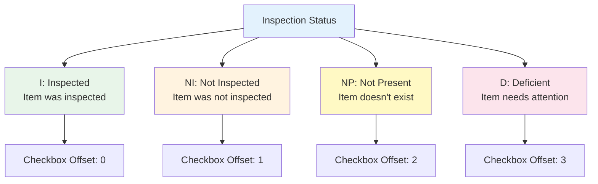

| Status | Meaning | Checkbox Offset | Usage |
|--------|---------|-----------------|-------|
| **I** | Inspected | 0 | Item examined, no issues |
| **NI** | Not Inspected | 1 | Item not examined |
| **NP** | Not Present | 2 | Item doesn't exist |
| **D** | Deficient | 3 | Item has issues |

---

## 📐 Checkbox Calculation

### Algorithm

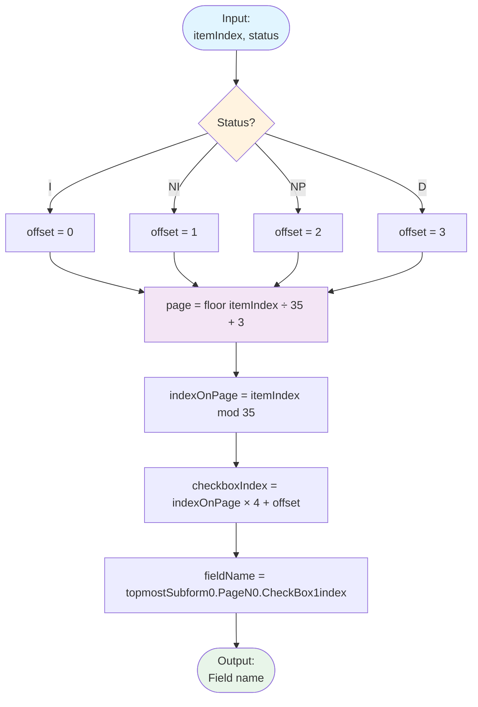

### Examples

```
Example 1: First item, Inspected
  itemIndex = 0, status = "I"
  → offset = 0
  → page = ⌊0/35⌋ + 3 = 3
  → indexOnPage = 0 % 35 = 0
  → checkboxIndex = 0×4 + 0 = 0
  → topmostSubform[0].Page3[0].CheckBox1[0]

Example 2: Item 37, Deficient
  itemIndex = 37, status = "D"
  → offset = 3
  → page = ⌊37/35⌋ + 3 = 4
  → indexOnPage = 37 % 35 = 2
  → checkboxIndex = 2×4 + 3 = 11
  → topmostSubform[0].Page4[0].CheckBox1[11]

Example 3: Last supported item, Not Present
  itemIndex = 35, status = "NP"
  → offset = 2
  → page = ⌊35/35⌋ + 3 = 4
  → indexOnPage = 35 % 35 = 0
  → checkboxIndex = 0×4 + 2 = 2
  → topmostSubform[0].Page4[0].CheckBox1[2]
```

---

## 🎨 Template Limitations

### Capacity

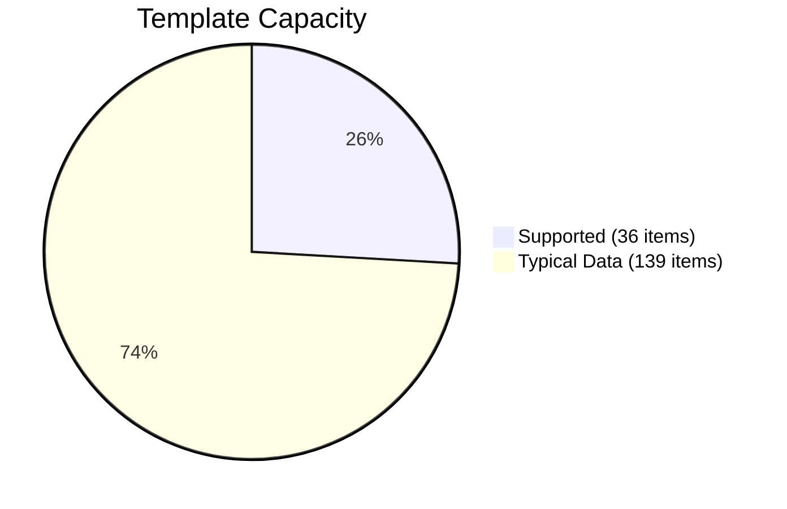

| Aspect | Limit | Note |
|--------|-------|------|
| **Max items with checkboxes** | 36 | Template has 144 checkboxes (36×4) |
| **Pages with checkboxes** | 3 | Pages 3, 4, 5 |
| **Items per page** | 12 | Fixed layout |
| **Typical inspection** | 139 items | Exceeds template capacity |

### Workaround

**Solution:** Generate additional pages dynamically

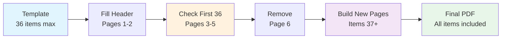

---

## 📄 Header & Footer

### Header Format (Pages 3+)

```
─────────────────────────────────────────────────────
Report Identification: ________________________________

┌──────────────────────────────────────────────────┐
│ I=Inspected  NI=Not Inspected  NP=Not Present   │
│                    D=Deficient                    │
└──────────────────────────────────────────────────┘

┌──────────────────────────────────────────────────┐
│     I          NI          NP          D         │
└──────────────────────────────────────────────────┘
```

**Components:**
- Top line (horizontal rule)
- Report Identification label with underline
- Legend box explaining status codes
- Checkbox legend showing I, NI, NP, D

### Footer Format (Pages 3+)

```
─────────────────────────────────────────────────────
                  Page 3 of 98

REI 7-6 (8/9/21)    Promulgated by the Texas Real...
```

**Components:**
- Top line (horizontal rule)
- Page number (centered)
- REI reference (bottom left)
- Promulgated text with hyperlink (bottom right)

---

## 🔍 Field Name Patterns

### Text Field Pattern

```
topmostSubform[0].Page{N}[0].{FieldName}[0]
```

**Examples:**
- `topmostSubform[0].Page1[0].ClientName[0]`
- `topmostSubform[0].Page1[0].InspectorName[0]`

### Checkbox Pattern

```
topmostSubform[0].Page{N}[0].CheckBox1[{index}]
```

**Examples:**
- `topmostSubform[0].Page3[0].CheckBox1[0]` (Page 3, first checkbox)
- `topmostSubform[0].Page4[0].CheckBox1[47]` (Page 4, last checkbox)

---

## 📊 Data Statistics

### Typical Inspection Data

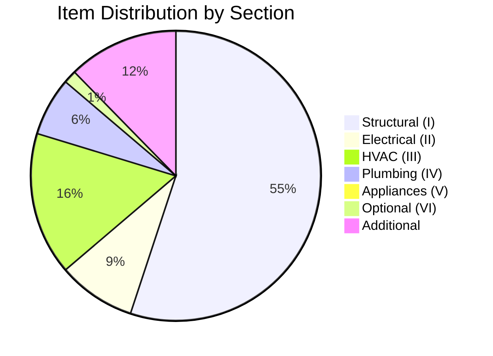

| Section | Items | Percentage |
|---------|-------|------------|
| I. Structural Systems | 76 | 54.7% |
| II. Electrical Systems | 12 | 8.6% |
| III. HVAC Systems | 22 | 15.8% |
| IV. Plumbing Systems | 9 | 6.5% |
| V. Appliances | 1 | 0.7% |
| VI. Optional Systems | 2 | 1.4% |
| Additional Items | 17 | 12.2% |
| **Total** | **139** | **100%** |

---

## 🎯 Key Findings

### 1. Template Constraints

- ✅ Template supports 36 items
- ❌ Typical data has 139 items
- **Solution:** Dynamic page generation

### 2. Section Mapping

- ✅ Clear section hierarchy
- ✅ Consistent subsection naming
- ✅ Keywords for matching

### 3. Status Codes

- ✅ Four distinct statuses (I, NI, NP, D)
- ✅ Predictable checkbox calculation
- ✅ No ambiguity

### 4. Media Support

- ❌ Template has no image fields
- ❌ Template has no video fields
- **Solution:** Generate additional pages for media

---

## 🔄 Evolution

### Template Version History

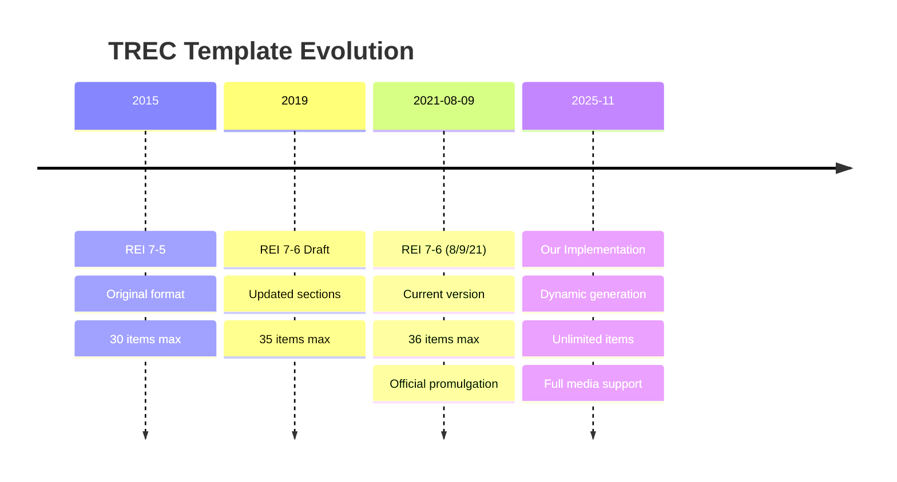

---

## 📋 Comparison

### Template vs. Implementation

| Feature | Template | Our Implementation |
|---------|----------|--------------------|
| **Item Capacity** | 36 items | Unlimited |
| **Images** | Not supported | ✅ Supported (separate pages) |
| **Videos** | Not supported | ✅ QR codes on separate pages |
| **Comments** | Not supported | ✅ Formatted with bullets |
| **Section Order** | Fixed | ✅ Dynamic (template order) |
| **Subsection Order** | Fixed | ✅ Alphabetical (A→B→C→D) |
| **Page Numbering** | Static | ✅ Dynamic ("Page X of Y") |
| **Hyperlinks** | Static | ✅ Clickable links |

---

## 🎓 Lessons Learned

### 1. Form Flattening

**Issue:** Can't modify form after removing pages

**Solution:** Flatten header pages before removing content pages

### 2. Page Capacity

**Issue:** Template limited to 36 items

**Solution:** Build new pages dynamically after template pages

### 3. Checkbox Calculation

**Issue:** Complex field naming pattern

**Solution:** Mathematical formula for field name calculation

### 4. Media Handling

**Issue:** No image/video support in template

**Solution:** Generate additional pages with proper headers/footers

---

## 📝 Recommendations

### For Future Templates

1. **Increase Capacity**: Support at least 150 items
2. **Add Comment Fields**: Dedicated text areas for each item
3. **Add Media Fields**: Support for images and videos
4. **Flexible Layout**: Allow variable items per page
5. **Modern Format**: Use fillable fields throughout

### For Implementation

1. **Cache Images**: Store downloaded images locally
2. **Parallel Processing**: Process images in parallel
3. **Optimize Size**: Compress images before embedding
4. **Error Recovery**: Handle all edge cases gracefully
5. **Performance Monitoring**: Track generation times

---

**Analysis Version**: 2.0  
**Last Updated**: November 4, 2025  
**Status**: ✅ Complete and Validated
