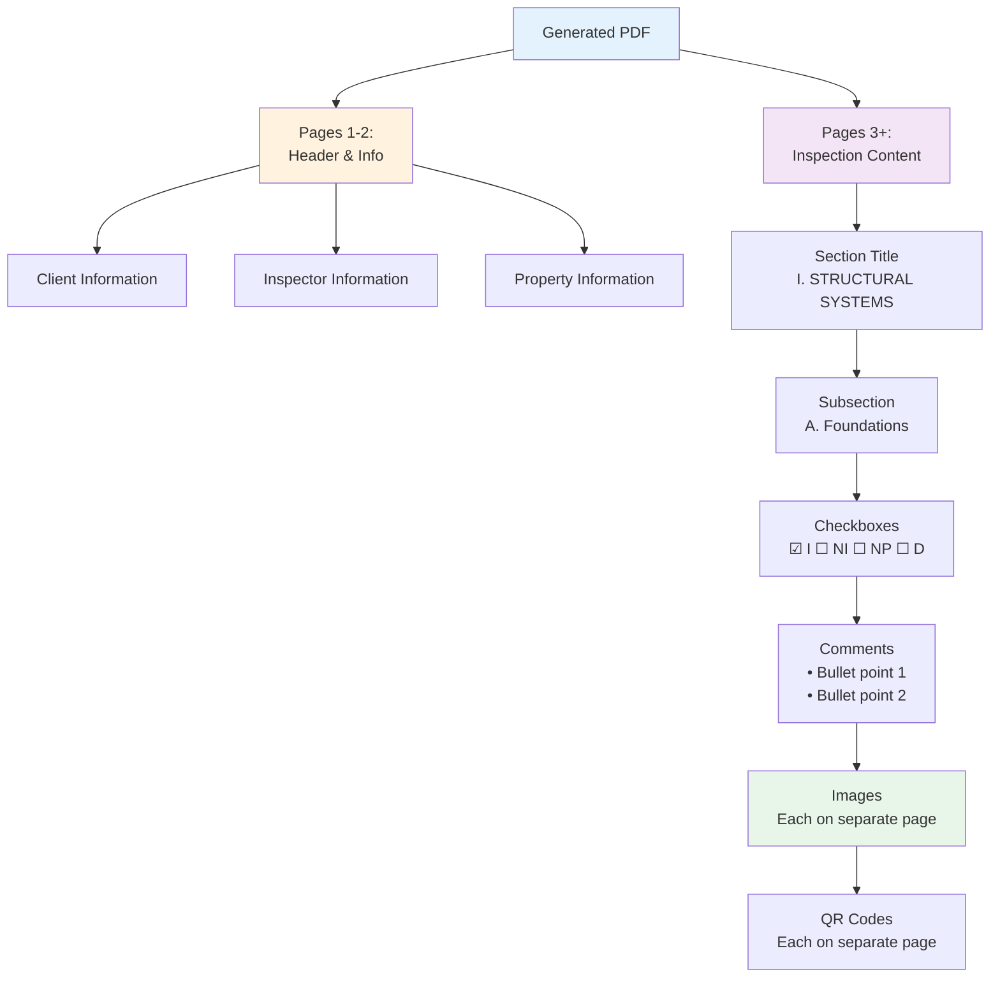
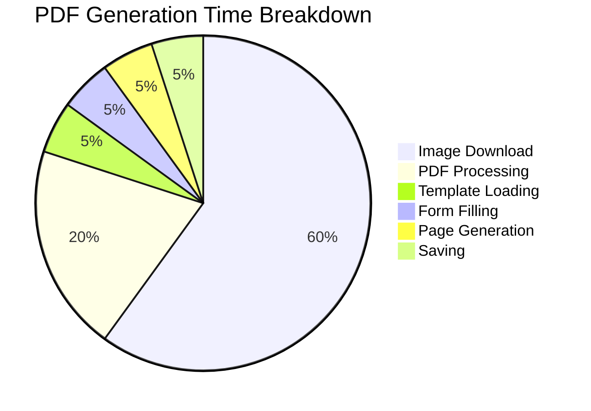
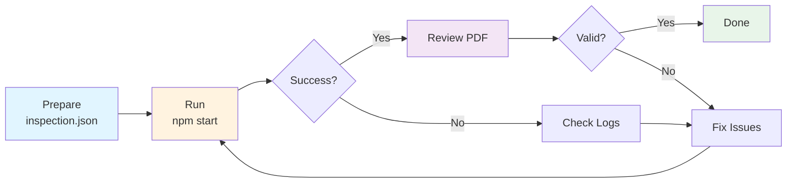

# TREC PDF Generator - Quick Reference

**Version:** 2.0  
**Date:** November 4, 2025  
**Status:** Production Ready ✅

---

## 🚀 Quick Start

### Generate PDF (Default)

```bash
npm start
```

Generates from `assets/inspection.json` → `output/TREC_Report_[timestamp].pdf`

### Generate PDF (Custom Input)

```bash
npm start path/to/custom_inspection.json
```

### Generate PDF (Custom Output)

```bash
npm start assets/inspection.json custom_output.pdf
```

---

## 📂 Project Structure

```
binsr_challenge/
├── src/                      # Source code
│   ├── services/            # Core services (4 files)
│   │   ├── TRECGenerator.ts      # Main orchestrator
│   │   ├── TRECPageBuilder.ts    # Page generation
│   │   ├── TemplateAnalyzer.ts   # Template parsing
│   │   └── FormFiller.ts         # Form filling
│   ├── mappers/             # Data transformation (2 files)
│   ├── types/               # TypeScript types (2 files)
│   ├── utils/               # Utilities (3 files)
│   ├── config/              # Configuration (2 files)
│   ├── debug/               # Debug scripts (3 files)
│   └── index.ts             # Entry point
├── docs/                    # Documentation
├── assets/                  # Input files & templates
├── output/                  # Generated PDFs
└── dist/                    # Compiled JavaScript
```

---

## 🔧 Common Commands

| Command | Description |
|---------|-------------|
| `npm install` | Install dependencies |
| `npm run build` | Compile TypeScript |
| `npm start` | Generate PDF (default) |
| `npm run dev` | Build + Run |
| `npm run clean` | Remove dist folder |
| `npm run debug:fields` | Inspect PDF fields |
| `npm run debug:template` | Inspect template |

---

## 📊 Input Data Format

### inspection.json Structure

```json
{
  "inspectionDetails": {
    "client": {
      "name": "John Doe",
      "email": "john@example.com",
      "phone": "(555) 123-4567"
    },
    "inspector": {
      "name": "Jane Inspector",
      "license": "TREC12345",
      "phone": "(555) 987-6543"
    },
    "property": {
      "address": "123 Main St, Austin, TX 78701"
    },
    "inspectionDate": "2025-11-04T10:00:00Z"
  },
  "sections": [
    {
      "sectionName": "Structural Systems",
      "items": [
        {
          "lineNumber": 1,
          "title": "Foundations",
          "status": "I",
          "comments": [
            {
              "text": "Foundation appears stable\nMinor settling observed"
            }
          ],
          "photos": [
            {
              "url": "https://example.com/photo1.jpg",
              "caption": "Foundation view"
            }
          ],
          "videos": []
        }
      ]
    }
  ]
}
```

---

## 🎯 Status Codes

| Code | Meaning | Checkbox |
|------|---------|----------|
| `I` | Inspected | ☑ I |
| `NI` | Not Inspected | ☑ NI |
| `NP` | Not Present | ☑ NP |
| `D` | Deficient | ☑ D |
| `null` | No checkbox | (none) |

---

## 📝 Comment Formatting

### Input (multi-line text)

```json
{
  "text": "Foundation appears stable\nMinor settling observed\nNo structural concerns"
}
```

### Output (bullet points)

```
Comments:
• Foundation appears stable
• Minor settling observed
• No structural concerns
```

---

## 🏗️ PDF Structure



---

## 🔍 Configuration Files

### config/constants.ts

```typescript
// Field names in PDF template
export const FORM_FIELDS = {
  CLIENT_NAME: 'topmostSubform[0].Page1[0].ClientName[0]',
  INSPECTOR_NAME: 'topmostSubform[0].Page1[0].InspectorName[0]',
  // ... more fields
}

// Status to checkbox offset
export const STATUS_TO_CHECKBOX = {
  'I': 0,
  'NI': 1,
  'NP': 2,
  'D': 3,
}

// Page configuration
export const PAGE_CONFIG = {
  ITEMS_PER_PAGE: 35,
  MAX_CHECKBOX_ITEMS: 36,
}
```

### config/sectionMapping.ts

```typescript
// TREC template sections
export const TREC_TEMPLATE_SECTIONS: TemplateSection[] = [
  {
    romanNumeral: 'I',
    name: 'STRUCTURAL SYSTEMS',
    subsections: [
      { letter: 'A', name: 'Foundations', keywords: ['foundation'] },
      { letter: 'B', name: 'Grading and Drainage', keywords: ['grading', 'drainage'] },
      // ... more subsections
    ]
  },
  // ... more sections
]
```

---

## 🎨 Header & Footer Format

### Header (Pages 3+)

```
─────────────────────────────────────────────
Report Identification: ___________________

┌─────────────────────────────────────────┐
│ I=Inspected  NI=Not Inspected          │
│ NP=Not Present  D=Deficient             │
└─────────────────────────────────────────┘
┌─────────────────────────────────────────┐
│ I        NI        NP        D          │
└─────────────────────────────────────────┘
```

### Footer (Pages 3+)

```
─────────────────────────────────────────────
                 Page 3 of 98
REI 7-6 (8/9/21)    [LINK] Promulgated by...
```

---

## 🐛 Troubleshooting

### Error: Template Not Found

```
❌ Error: File not found: assets/TREC_Template_Blank.pdf
```

**Solution:**
```bash
# Check file exists
ls -la assets/TREC_Template_Blank.pdf

# Verify permissions
chmod 644 assets/TREC_Template_Blank.pdf
```

### Error: Image Loading Failed

```
⚠️ Failed to add image: https://example.com/photo.jpg
Error: SOI not found in JPEG
```

**Solution:**
- This is a data issue (corrupted JPEG)
- Application continues gracefully
- PDF generates without this image
- Replace corrupted image at source

### Error: Memory Issues

```
❌ JavaScript heap out of memory
```

**Solution:**
```bash
# Increase Node.js memory
NODE_OPTIONS=--max-old-space-size=4096 npm start
```

### Issue: Wrong Subsection Order

**Problem:** Subsections appear as D, B, A instead of A, B, C, D

**Solution:** Already fixed in v2.0 - subsections are now sorted alphabetically

### Issue: Images Overlay Text

**Problem:** Images appear on top of text

**Solution:** Already fixed in v2.0 - images are on completely separate pages

---

## 📊 Performance Tips

### 1. Optimize Images

```bash
# Resize images before adding to inspection.json
# Recommended: 1920x1080 max, ~500KB each

# Example with ImageMagick
convert input.jpg -resize 1920x1080 -quality 85 output.jpg
```

### 2. Use Local Images

```json
{
  "photos": [
    {
      "url": "file:///path/to/local/image.jpg",
      "caption": "Local image"
    }
  ]
}
```

### 3. Parallel Processing

```bash
# Process multiple PDFs in parallel
npm start inspection1.json output1.pdf &
npm start inspection2.json output2.pdf &
npm start inspection3.json output3.pdf &
wait
```

---

## 📈 Metrics

### Generation Times



| Component | Time | Percentage |
|-----------|------|------------|
| Image Download | ~14s | 60% |
| PDF Processing | ~5s | 20% |
| Template Load | ~1s | 5% |
| Form Filling | ~1s | 5% |
| Page Generation | ~1s | 5% |
| Saving | ~1s | 5% |
| **Total** | **~23s** | **100%** |

---

## 🔧 Debug Mode

### Inspect PDF Fields

```bash
npm run debug:fields
```

**Output:**
```
Found 150 form fields:
  - topmostSubform[0].Page1[0].ClientName[0]
  - topmostSubform[0].Page1[0].InspectorName[0]
  ...
```

### Inspect Template Structure

```bash
npm run debug:template
```

**Output:**
```
Template Structure:
  - 6 pages
  - 150 form fields
  - 144 checkboxes
  - 36 items supported
```

### Compare PDFs

```bash
npm run debug:compare
```

Compares generated PDF with `TREC_Sample_Filled.pdf`

---

## 📦 Output

### File Naming

Format: `TREC_Report_YYYY-MM-DD_timestamp.pdf`

Example: `TREC_Report_2025-11-04_1762218467701.pdf`

### File Contents

| Section | Pages | Content |
|---------|-------|---------|
| Header | 1-2 | Client/inspector info |
| Structural Systems | 3-45 | 76 items + images |
| Electrical Systems | 46-52 | 12 items + images |
| HVAC Systems | 53-68 | 22 items + images |
| Plumbing Systems | 69-81 | 9 items + images |
| Appliances | 82-83 | 1 item |
| Optional Systems | 84-85 | 2 items |
| Additional Items | 86-98 | 17 items + images |

---

## 🎯 Best Practices

### Data Preparation

✅ **Do:**
- Validate JSON structure
- Use consistent status codes (I, NI, NP, D)
- Format comments with line breaks
- Optimize images before adding
- Use descriptive captions

❌ **Don't:**
- Use custom status codes
- Include HTML in comments
- Use extremely large images (>5MB)
- Mix file:// and http:// URLs randomly

### Development

✅ **Do:**
- Use TypeScript strict mode
- Add JSDoc comments
- Keep functions focused
- Use Mermaid for diagrams
- Update documentation

❌ **Don't:**
- Use `any` type
- Create duplicate services
- Hard-code configuration
- Skip error handling

---

## 🔄 Workflow



---

## 📞 Quick Links

| Resource | Link |
|----------|------|
| Full Architecture | [ARCHITECTURE.md](./ARCHITECTURE.md) |
| Analysis Summary | [ANALYSIS_SUMMARY.md](./ANALYSIS_SUMMARY.md) |
| Main Documentation | [README.md](./README.md) |
| TREC Website | https://www.trec.texas.gov |
| pdf-lib Docs | https://pdf-lib.js.org/ |

---

## 💡 Pro Tips

### Tip 1: Caching Images

```javascript
// Create image cache directory
mkdir -p .cache/images

// Download images once, reuse for multiple PDFs
// Implement in future version
```

### Tip 2: Batch Processing

```bash
# Process all JSON files in a directory
for file in inspections/*.json; do
  npm start "$file"
done
```

### Tip 3: Performance Monitoring

```bash
# Time the generation
time npm start inspection.json

# Monitor memory usage
node --trace-warnings dist/index.js
```

### Tip 4: Custom Templates

```typescript
// Use custom template in config/constants.ts
export const PATHS = {
  TEMPLATE: 'assets/Custom_Template.pdf',
  // ...
}
```

---

## ✅ Checklist

### Before Generation

- [ ] `inspection.json` is valid JSON
- [ ] All required fields present
- [ ] Image URLs are accessible
- [ ] Template file exists
- [ ] Output directory is writable

### After Generation

- [ ] PDF opens without errors
- [ ] All fields filled correctly
- [ ] Checkboxes checked properly
- [ ] Subsections in order (A→B→C→D)
- [ ] Comments formatted with bullets
- [ ] Images on separate pages
- [ ] Page numbers correct ("Page X of Y")
- [ ] Hyperlinks work

---

## 🎓 Examples

### Example 1: Basic Generation

```bash
$ npm start

> trec-pdf-generator@1.0.0 start
> node dist/index.js

============================================================
  TREC PDF Generator
============================================================

📂 Loading inspection data from: assets/inspection.json
✓ Inspection data loaded successfully

🔧 Starting PDF generation...
✓ PDF generated successfully

📄 Output file: output/TREC_Report_2025-11-04_1762218467701.pdf
📊 File size: 89.50 MB
⏱️  Time taken: 23.32s
⚡ Performance: 3.84 MB/s

✅ SUCCESS!
============================================================
```

### Example 2: Custom Files

```bash
$ npm start custom/inspection.json custom/output.pdf

📂 Loading inspection data from: custom/inspection.json
...
📄 Output file: custom/output.pdf
✅ SUCCESS!
```

### Example 3: Debug Mode

```bash
$ npm run debug:fields

Inspecting PDF fields in template...
Found 150 form fields:

Text Fields (6):
  ✓ ClientName
  ✓ InspectorName
  ✓ PropertyAddress
  ...

Checkboxes (144):
  ✓ Page3[0].CheckBox1[0]
  ✓ Page3[0].CheckBox1[1]
  ...
```

---

**Quick Reference Version**: 2.0  
**Last Updated**: November 4, 2025  
**Status**: ✅ Complete and Current
