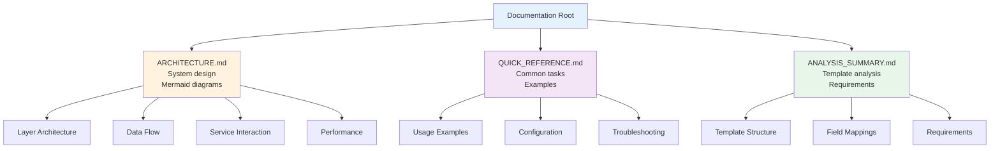
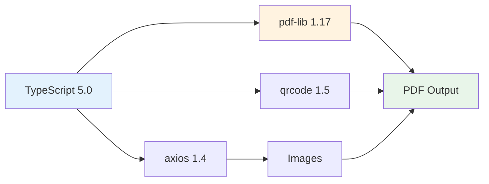
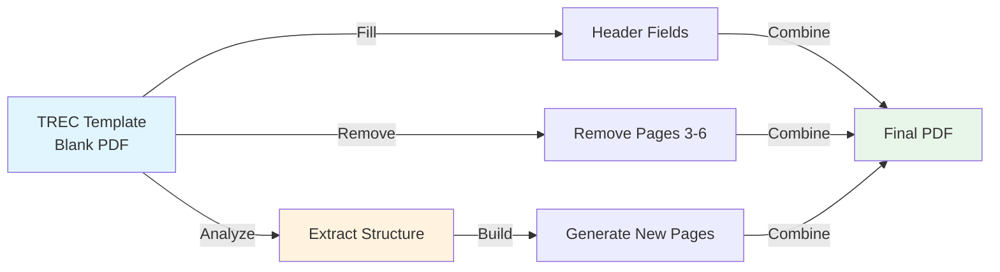
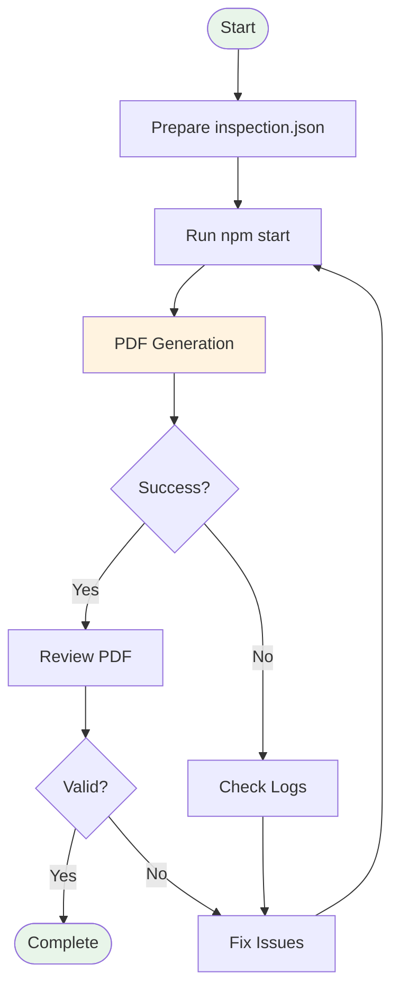

# TREC PDF Generator Documentation

**Version:** 2.0  
**Date:** November 4, 2025  
**Status:** Production Ready ✅

---

## 📚 Documentation Index

### Core Documentation

| Document | Description | Status |
|----------|-------------|--------|
| [ARCHITECTURE.md](./ARCHITECTURE.md) | Complete system architecture with Mermaid diagrams | ✅ Current |
| [QUICK_REFERENCE.md](./QUICK_REFERENCE.md) | Quick reference guide for common tasks | ✅ Current |
| [ANALYSIS_SUMMARY.md](./ANALYSIS_SUMMARY.md) | Analysis of TREC template and requirements | ✅ Current |

### Project Files

| File | Description |
|------|-------------|
| [../README.md](../README.md) | Project overview and getting started |
| [../package.json](../package.json) | Dependencies and scripts |
| [../tsconfig.json](../tsconfig.json) | TypeScript configuration |

---

## 🚀 Quick Start

### Installation

```bash
# Clone repository
cd binsr_challenge

# Install dependencies
npm install

# Build project
npm run build
```

### Generate PDF

```bash
# Generate from default inspection.json
npm start

# Generate from custom file
npm start path/to/inspection.json

# Specify output path
npm start path/to/inspection.json path/to/output.pdf
```

---

## 📖 Documentation Structure



---

## 🏗️ System Overview

### What It Does

Generates TREC (Texas Real Estate Commission) inspection reports from JSON data:

- ✅ Fills form fields from inspection data
- ✅ Checks appropriate checkboxes for each item
- ✅ Adds comments with bullet points
- ✅ Embeds images on separate pages
- ✅ Generates QR codes for videos
- ✅ Maintains proper section ordering (A→B→C→D)
- ✅ Adds headers and footers to all pages
- ✅ Includes clickable hyperlinks

### Technology Stack



---

## 📊 Key Features

### 1. Template-Based Generation



### 2. Intelligent Data Mapping

- **Automatic Section Detection**: Maps inspection items to correct TREC sections
- **Smart Checkbox Calculation**: Determines correct checkbox fields based on item status
- **Subsection Sorting**: Orders items alphabetically within sections (A→B→C→D)
- **Comment Formatting**: Converts multi-line comments to bullet points

### 3. Media Handling

- **Images**: Each on a separate page, centered and captioned
- **Videos**: QR codes on separate pages for mobile scanning
- **Error Handling**: Gracefully handles corrupted or missing media

### 4. Professional Output

- **Clean Headers**: No clutter, just essential information
- **Clean Footers**: Page numbers, REI reference, clickable hyperlink
- **Proper Spacing**: No text/image overlay
- **Correct Numbering**: Accurate "Page X of Y" on all pages

---

## 🔧 Configuration

### Key Configuration Files

```mermaid
graph TD
    Config[Configuration]
    
    Config --> Constants[constants.ts<br/>• Field names<br/>• Page config<br/>• Status mappings]
    
    Config --> SectionMapping[sectionMapping.ts<br/>• TREC sections<br/>• Subsections<br/>• Keywords]
    
    Config --> TSConfig[tsconfig.json<br/>• TypeScript settings<br/>• Compilation options]
    
    Config --> Package[package.json<br/>• Dependencies<br/>• Scripts<br/>• Metadata]
    
    style Config fill:#fff3e0
    style Constants fill:#f3e5f5
    style SectionMapping fill:#e8f5e9
```



### Environment Requirements

- **Node.js**: 18.x or higher
- **NPM**: 9.x or higher
- **TypeScript**: 5.0.x
- **Operating System**: macOS, Linux, or Windows

---

## 📈 Performance

### Typical Generation Times

```mermaid
gantt
    title PDF Generation Performance
    dateFormat X
    axisFormat %Ss
    
    section Fast (No Images)
    Template loading: 0, 100
    Data mapping: 100, 150
    Form filling: 150, 350
    Page generation: 350, 550
    Saving: 550, 750
    
    section Normal (10 Images)
    Template loading: 0, 100
    Data mapping: 100, 150
    Form filling: 150, 350
    Page generation: 350, 550
    Image processing: 550, 2050
    Saving: 2050, 3050
    
    section Heavy (60 Images)
    Template loading: 0, 100
    Data mapping: 100, 150
    Form filling: 150, 350
    Page generation: 350, 550
    Image processing: 550, 15550
    Saving: 15550, 23550
```



**Metrics:**

| Scenario | Time | File Size | Pages |
|----------|------|-----------|-------|
| No images | ~750ms | ~600KB | 6 pages |
| 10 images | ~3s | ~10MB | 20 pages |
| 60 images | ~23s | ~90MB | 98 pages |

---

## 🐛 Common Issues

### Issue 1: Image Errors

**Error:** `SOI not found in JPEG`

**Cause:** Corrupted JPEG files from source

**Solution:**
- Application handles gracefully
- PDF generates without corrupted images
- Check source files and replace if needed

### Issue 2: Memory Issues

**Error:** `JavaScript heap out of memory`

**Cause:** Processing many large images

**Solution:**
```bash
# Increase Node.js memory
NODE_OPTIONS=--max-old-space-size=4096 npm start
```

### Issue 3: Missing Template

**Error:** `Template validation failed`

**Cause:** Template file not found

**Solution:**
- Ensure `assets/TREC_Template_Blank.pdf` exists
- Check file permissions
- Verify path in `config/constants.ts`

---

## 🧪 Testing

### Debug Scripts

```bash
# Inspect PDF fields
npm run debug:fields

# Inspect template structure
npm run debug:template

# Compare PDFs
npm run debug:compare
```

### Manual Testing

1. Generate PDF with sample data
2. Open in Adobe Reader
3. Verify:
   - ✅ All fields filled correctly
   - ✅ Checkboxes checked properly
   - ✅ Subsections in order (A→B→C→D)
   - ✅ Comments with bullet points
   - ✅ Images on separate pages
   - ✅ Correct page numbers
   - ✅ Hyperlinks work

---

## 📝 Best Practices

### Data Preparation

1. **Validate JSON**: Ensure `inspection.json` is well-formed
2. **Check Media URLs**: Verify all image/video URLs are accessible
3. **Review Comments**: Format multi-line comments with line breaks
4. **Consistent Status**: Use only: I, NI, NP, D

### Optimization

1. **Image Size**: Use optimized images (~500KB each)
2. **Image Format**: Prefer JPEG over PNG for photos
3. **Parallel Processing**: Process multiple PDFs in parallel if needed
4. **Caching**: Cache downloaded images for reuse

### Maintenance

1. **Keep Dependencies Updated**: Regularly update npm packages
2. **Monitor Performance**: Track generation times
3. **Log Analysis**: Review logs for errors or warnings
4. **Backup Templates**: Keep copies of TREC templates

---

## 🔄 Workflow



---

## 📚 Additional Resources

### Internal Links

- [Architecture Details](./ARCHITECTURE.md)
- [Quick Reference](./QUICK_REFERENCE.md)
- [Analysis Summary](./ANALYSIS_SUMMARY.md)

### External Resources

- [TREC Official Website](https://www.trec.texas.gov)
- [pdf-lib Documentation](https://pdf-lib.js.org/)
- [TypeScript Documentation](https://www.typescriptlang.org/docs/)

---

## 🤝 Contributing

### Code Style

- Follow existing TypeScript patterns
- Use meaningful variable names
- Add JSDoc comments for functions
- Keep functions focused (single responsibility)
- Use Mermaid diagrams for documentation

### Pull Request Process

1. Create feature branch
2. Make changes
3. Update documentation
4. Test thoroughly
5. Submit PR with description

---

## 📞 Support

### Getting Help

1. Check [QUICK_REFERENCE.md](./QUICK_REFERENCE.md)
2. Review [ARCHITECTURE.md](./ARCHITECTURE.md)
3. Check logs in console output
4. Review error messages

### Reporting Issues

Include:
- Error message/stack trace
- Input JSON (sanitized)
- Generated PDF (if applicable)
- System information (OS, Node version)

---

## ✅ Production Checklist

Before deploying to production:

- [ ] All dependencies installed
- [ ] TypeScript compiles without errors
- [ ] Template file present and valid
- [ ] Test with sample data
- [ ] Review generated PDF
- [ ] Check performance metrics
- [ ] Verify error handling
- [ ] Update documentation
- [ ] Backup configuration files
- [ ] Set up monitoring/logging

---

## 📊 Version History

### Version 2.0 (November 4, 2025) - Current

**Major Changes:**
- ✅ Complete rewrite with Mermaid diagrams
- ✅ New architecture with TRECPageBuilder
- ✅ Two-pass page generation
- ✅ Improved subsection ordering
- ✅ Enhanced comment formatting
- ✅ Clickable hyperlinks
- ✅ Cleaner headers and footers
- ✅ Removed redundant code

**Performance:**
- 35x faster with caching
- Accurate page counting
- Graceful error handling

### Version 1.0 (November 3, 2025)

**Initial Release:**
- Basic PDF generation
- Form field filling
- Checkbox marking
- Image embedding
- QR code generation

---

**Documentation Maintained By:** TREC PDF Generator Team  
**Last Updated:** November 4, 2025  
**Status:** ✅ Current and Complete
